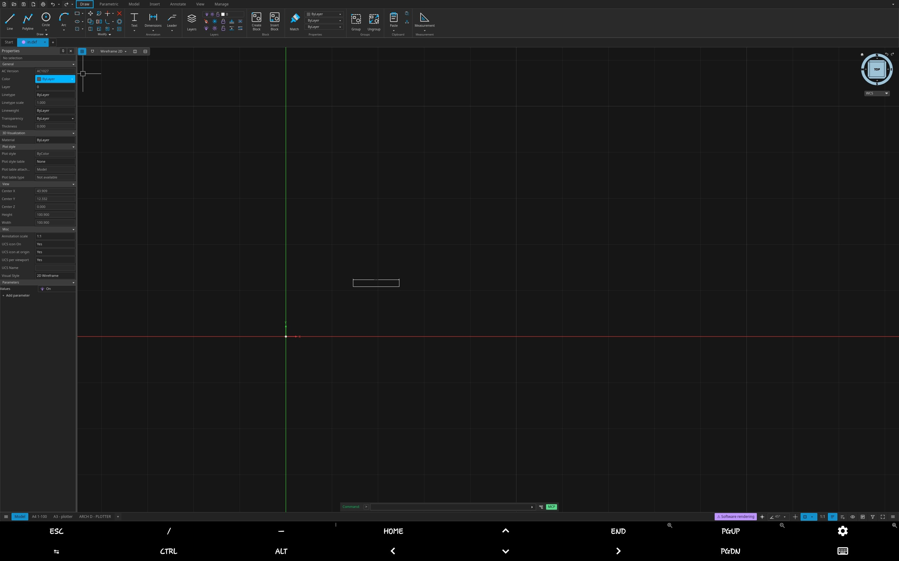

# Open CAD Studio en Android con Termux

Cómo ejecutar [Open CAD Studio](https://github.com/HakanSeven12/OpenCADStudio)
en un móvil o tablet Android bajo Termux. Hay dos formas, y las dos funcionan:

- **web** — la compilación wasm en Chrome. **Esta es la que usa la GPU de verdad.**
- **nativa** — la compilación glibc dentro de un contenedor proot, dibujada en
  Termux:X11. Funciona, pero renderiza por CPU.

> [English version](README.en.md)

Licencia GPL-3.0, igual que el proyecto original. Ver [LICENSE](LICENSE).

## De un vistazo

| | Web (Chrome) | Nativa (proot + Termux:X11) |
|---|---|---|
| GPU | **Real** — ANGLE sobre la GPU Mali | Ninguna; llvmpipe por CPU |
| Ventana | pestaña de Chrome / PWA | ventana Termux:X11 + matchbox |
| Compila para | `wasm32-unknown-unknown`, ~71 MB de wasm | `aarch64-unknown-linux-gnu` (glibc) |
| Velocidad | Fluida | Lenta; ver [Rendimiento](#rendimiento) |
| Sombreado (hatch) | No se dibuja (WebGL2 no tiene vertex storage buffers) | Sí |
| Abrir DWG/DXF | Sí, con el worker de parseo | Sí |
| Complementos nativos | No (el navegador no carga librerías nativas) | Sí |

Si quieres GPU, usa la **web**. Esa es toda la historia en Android: proot no
llega a la GPU del móvil, así que la versión nativa siempre es por software.
La razón está explicada en [Por qué no hay GPU en la versión nativa](#por-qué-no-hay-gpu-en-la-versión-nativa).

## Capturas

### Versión nativa dentro de Termux:X11



Captura de la edición **nativa**: una ventana real de Termux:X11 sobre Android, con
el dibujo cargado y el panel de Propiedades abierto. Se ve la fila de teclas
(`ESC`, `CTRL`, `ALT`, `HOME`) bajo la ventana, que es Termux mapeando el teclado
físico a la app.

## Requisitos

- **Termux instalado desde F-Droid.** La versión de Play Store está abandonada y
  es demasiado antigua para `proot-distro`.
- **La app Termux:X11** (un APK aparte). Solo hace falta para la versión nativa.
- **Chrome** en el dispositivo, para la versión web.
- **~6 GB libres.** El contenedor proot ocupa ~1.5 GB y cada compilación deja un
  `target/` de ~2 GB.

## Instalación rápida

En **Termux**, copia y pega esto:

```sh
pkg install x11-repo
pkg install git proot-distro python termux-api xdotool
pkg install termux-x11-nightly
```

> **Ojo con el nombre del paquete X11.** El paquete se llama
> `termux-x11-nightly`, pero el comando que instala es `termux-x11`. Escribir
> `termux-x11-nightly` como comando **falla**.

`matchbox-window-manager` es opcional pero recomendado: sin él la ventana
funciona igual, pero sin *tiling* ni control de pantalla completa.

```sh
pkg install matchbox-window-manager
```

Ahora la instalación completa:

```sh
git clone https://github.com/kipzitox/OpenCADStudio-Termux.git
sh OpenCADStudio-Termux/bootstrap.sh
```

Eso instala el contenedor, Rust, clona OpenCADStudio, aplica los parches,
compila y deja el comando `opencadstudio` disponible. **Tarda entre 15 y 30
minutos** según el dispositivo.

Si se corta (se acaba la batería, se cierra Termux), vuelve a ejecutar el mismo
comando: continúa donde se quedó en lugar de empezar de cero.

### Opciones de `bootstrap.sh`

```sh
sh OpenCADStudio-Termux/bootstrap.sh --web-only     # solo la web (GPU)
sh OpenCADStudio-Termux/bootstrap.sh --native-only  # solo la nativa
sh OpenCADStudio-Termux/bootstrap.sh --skip-build   # preparar, sin compilar
```

## Comandos

Una vez instalado:

```sh
opencadstudio          # menú interactivo
opencadstudio web      # versión web en Chrome (GPU real)
opencadstudio native   # ventana nativa en Termux:X11
opencadstudio native plano.dxf   # abrir un archivo concreto
opencadstudio close    # cerrar la ventana nativa
opencadstudio stop     # parar el servidor web
```

El menú ofrece web, nativa, cerrar y salir.

## Comprobar que funciona

**Web:**

```sh
opencadstudio web
curl -sI http://localhost:8097     # debe responder 200 OK
```

Debe abrirse una pestaña de Chrome con el editor y la GPU activa. Para ver que
la GPU se está usando, `chrome://gpu` debe listar el renderer de Mali vía ANGLE.

**Nativa:**

```sh
opencadstudio native
```

Debe abrirse una ventana titulada `Open CAD Studio 2026.39 - Start`.

> **Abre la app Termux:X11 en Android antes.** El servidor X11 por sí solo da una
> pantalla negra de 1280x1024. Al abrir la app, la ventana toma el tamaño real
> del panel.

## Pasos manuales

Si prefieres ver qué hace cada paso, o si algo falla y quieres entender por qué.
Cada bloque es copiable tal cual.

Estos comandos corren **dentro del contenedor**, y por eso llevan el
`proot-distro login debian -- /bin/sh -lc`. El `-lc` no es opcional: un `sh -c`
normal no carga `/root/.cargo/env`, así que `cargo` resuelve al `rustc 1.85` de
Debian y la compilación muere con un muro de errores `requires rustc 1.9x` que
parecen un problema de dependencias pero son un problema de `PATH`.

### 1. Contenedor y Rust

```sh
pkg install proot-distro
proot-distro install debian

proot-distro login debian -- /bin/sh -lc 'curl https://sh.rustup.rs -sSf | sh -s -- -y'
proot-distro login debian -- /bin/sh -lc 'rustc --version'   # debe ser >= 1.92
```

### 2. Código fuente, en la versión correcta

Los parches de este repo están hechos para `v2026.39`. Fijar la versión es
importante: si clonas `main` dentro de unos meses, los parches dejarán de
aplicar o, peor, aplicarán mal.

```sh
proot-distro login debian -- /bin/sh -lc \
  'git clone --depth 1 --branch v2026.39 https://github.com/HakanSeven12/OpenCADStudio.git /root/OpenCADStudio'
```

### 3. Parches

```sh
proot-distro login debian -- /bin/sh -lc \
  'cd /root/OpenCADStudio && sh /ruta/a/OpenCADStudio-Termux/patches/apply-patches.sh .'
```

Sustituye `/ruta/a/OpenCADStudio-Termux` por donde clonaste esta guía. Si
`apply-patches.sh` dice que no encuentra naga en la caché de Cargo, ejecuta
`cargo fetch` dentro del contenedor y repite.

Ver [PATCHES.md](PATCHES.md) para saber qué hace cada parche y por qué.

### 4. Compilar la web

Primero `wasm-bindgen-cli`, que debe coincidir con la versión del crate
(0.2.108 en `v2026.39`):

```sh
proot-distro login debian -- /bin/sh -lc \
  'cargo install wasm-bindgen-cli --version 0.2.108 --locked'
```

Luego el build:

```sh
proot-distro login debian -- /bin/sh -lc \
  'cd /root/OpenCADStudio && sh /ruta/a/OpenCADStudio-Termux/scripts/build-web.sh'
```

> ¿Por qué no `trunk`? Upstream lo usa, y aquí no funciona: su árbol de
> dependencias arrastra dos versiones incompatibles de `cssparser` y la
> compilación muere al resolverlas. `build-web.sh` hace a mano lo que haría
> `trunk`.

### 5. Compilar la nativa

```sh
proot-distro login debian -- /bin/sh -lc \
  'cd /root/OpenCADStudio && sh /ruta/a/OpenCADStudio-Termux/scripts/build-native.sh'
```

### 6. Instaladores

```sh
sh /ruta/a/OpenCADStudio-Termux/scripts/install-launcher.sh
```

## Rendimiento

La versión nativa es solo CPU, así que lo que de verdad mueve la aguja es
cuántos núcleos alimentan el rasterizador. `LP_NUM_THREADS` vale 4 por defecto,
que fue lo más rápido medido en un dispositivo de 8 núcleos:

| hilos | ms/frame | fps |
|---|---|---|
| 1 | 1091 | 0.92 |
| 2 | 892 | 1.12 |
| **4** | **428** | **2.33** |
| 8 | 472 | 2.12 |

8 es más lento que 4: a partir de cuatro, los hilos del rasterizador compiten
con los de la interfaz por los mismos ocho núcleos, y la intercepción de
syscalls de proot añade coste por llamada.

Para comparar:

```sh
OCS_LP_THREADS=1 ocs
OCS_LP_THREADS=8 ocs
```

El panel PERF de la aplicación muestra el ms/frame en vivo mientras arrastras el
dibujo.

## Por qué no hay GPU en la versión nativa

proot es un traductor de syscalls basado en `ptrace`, no una máquina virtual. La
GPU de Android solo se alcanza a través de un driver bionic que habla con el HAL
de Mali, y nada de eso existe dentro de un contenedor glibc. En concreto:

- `/dev/dri/card0` es `root:system`, modo 660 — la app recibe `Permission denied`.
- No existe ningún nodo `/dev/dri/renderD*`.
- El único driver real es `/vendor/lib64/hw/vulkan.mali.so`, un `.so` **bionic**.

Mesa está instalada e incluye `panfrost_icd.json` (PanVK, el driver correcto
para Mali), pero Panfrost necesita un nodo DRM render para abrir un fd de GPU, y
no hay ninguno.

Los otros backends tampoco ayudan, y conviene dejarlo escrito para que nadie lo
vuelva a discutir:

| Backend | Resultado |
|---|---|
| `vulkan` | sin adaptadores de hardware |
| `gl` | sin adaptadores, ni software — Termux:X11 no tiene GLX y el EGL de Mesa no llega |
| `sw` | `llvmpipe (LLVM 19.1.7)` — el único rasterizador disponible |

Así que la versión nativa usa llvmpipe de todos modos. Cambiar de Vulkan a otra
API no cambiaría nada, porque ambas acabarían rasterizando en los mismos núcleos.
Lo que mueve el número es el número de hilos.

Si necesitas GPU en Android, usa la versión web.

## Problemas frecuentes

| Síntoma | Causa | Solución |
|---|---|---|
| Canvas en blanco | sirviendo desde el directorio equivocado | sirve desde `web-dist/` |
| Abrir un DWG se queda al 10% | falta `worker_pkg/` | ejecuta `build-web.sh`; no montes `web-dist/` a mano |
| Las descargas llegan como `.txt` | parche de MIME no aplicado | aplica `0001`; recompila el wasm |
| Canvas en blanco en Chrome, sin error | bug de driver de naga | aplica `0002` |
| Cada línea `[gpu]` sale dos veces | el aviso lo imprimen dos sitios | aplica `0001`; recompila |
| Pánico `XOpenDisplayFailed` | falta `.X11-unix` en el contenedor | `mkdir -p $PREFIX/tmp/.X11-unix` |
| «Termux:X11 no arrancó» | el servidor X ya corre como servicio de la app Android | abre la app Termux:X11, o `pkill termux-x11` y relanza |
| Ventana a 1280x1024 | la app X11 no se ha conectado | abre la app Termux:X11 |
| `rustc 1.85.1 is not supported` | usaste `sh -c` en vez de `sh -lc` | usa una shell de login |
| Los parches no aplican | el checkout no es `v2026.39` | reclona con `--branch v2026.39` |
| `git add -A` intenta subir 76 MB | `web-dist/` no está ignorado en upstream | `echo web-dist/ >> .git/info/exclude` |
| `command not found: termux-x11-nightly` | ese es el paquete, no el comando | el comando es `termux-x11` |

## Estructura del repo

```
bootstrap.sh              instalador de un comando (idempotente)
README.md                 esta guía
README.en.md              la misma guía, en inglés
PATCHES.md                qué hace cada parche y por qué
docs/screenshots/         capturas de pantalla
patches/                  0001, 0002, apply-patches.sh
scripts/                  build-web.sh, build-native.sh, install-launcher.sh,
                          serve-web.sh
termux/                   ocs, opencadstudio, ocs-termux.sh, ocs-perf.scr
web/index.html            arranque que sustituye al de trunk
```

## Licencia y atribución

GPL-3.0, igual que [Open CAD Studio](https://github.com/HakanSeven12/OpenCADStudio),
cuyos autores son los del proyecto original. Los parches de este repo son
modificaciones sobre código GPL, así que se publican bajo la misma licencia.

Si crees que algún arreglo debería llegar al proyecto original, lo natural es un
PR a upstream en lugar de mantener un fork permanente.